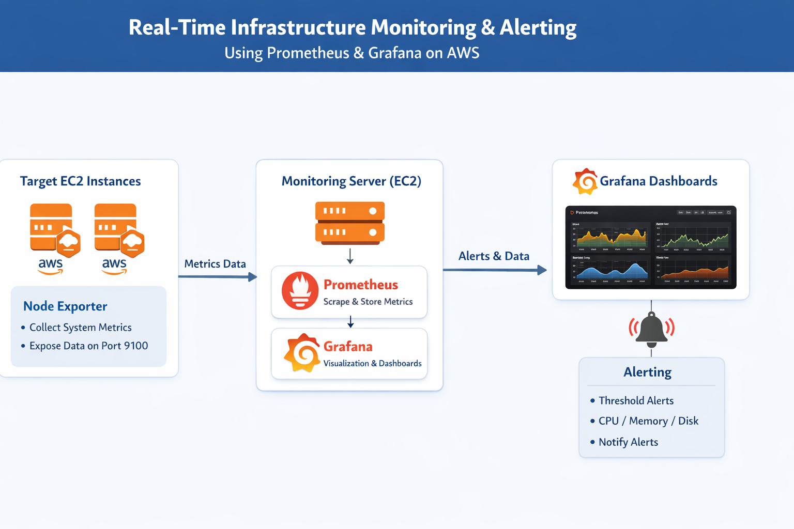

# Real-Time Infrastructure Monitoring and Alerting using Prometheus and Grafana on EC2 

## 📖 Project Overview

This project focuses on building a real-time monitoring system for AWS EC2 instances using Prometheus and Grafana. It enables centralized tracking of system metrics such as CPU usage, memory utilization, and disk performance across multiple servers, reducing the need for manual monitoring.

Prometheus collects and stores metrics from EC2 instances using Node Exporter, while Grafana provides interactive dashboards for visualization. Additionally, an alerting mechanism is configured to notify when resource usage exceeds defined thresholds, helping in proactive issue detection and improving overall system reliability.

---
## 🎯 Objectives
- To implement a real-time monitoring solution for cloud infrastructure
- To track system performance metrics across multiple EC2 instances
- To visualize data using interactive dashboards
- To configure alerting for proactive issue detection

---

## 🏗️ System Architecture
This project follows a centralized monitoring architecture where a dedicated monitoring server collects and visualizes metrics from multiple target servers.

- A monitoring EC2 instance runs Prometheus and Grafana
- Target EC2 instances run Node Exporter to expose system metrics
- Prometheus pulls metrics at regular intervals
- Grafana displays the data through dashboards and triggers alerts

 

 ---
 
## 📂 Project Structure

```bash
Prometheus-grafana-monitoring/
│
├── README.md
├── prometheus.yml
│
├── Screenshots/
│   ├── Prometheus_targets.png
│   ├── Node_exporter_metrics.png
│   ├── Grafana_dashboard.png
│   ├── CPU_memory_disk_graph.png
│   └── Alert_rules.png
```


---

## 🛠️ Technologies Used
- Amazon EC2     : Used for hosting monitoring and target servers  
- Prometheus     : Used for collecting and storing metrics  
- Grafana        : Used for visualizing data through dashboards  
- Node Exporter  : Used for exposing system-level metrics   

---

## ⚙️ Implementation Steps

### Step 1: Launch EC2 Instances 
- Launch 1 EC2 instance (Monitoring Server)
- Launch 2 EC2 instances (Target Servers)

---
### Step 2: Configure Security Groups
#### 📌 Monitoring Server (Prometheus + Grafana)  

| Port | Purpose |
|------|---------|
| 22   | SSH Access |
| 9090 | Prometheus UI |
| 3000 | Grafana Dashboard |

#### 📌 Target Servers (Node Exporter)  

| Port | Purpose |
|------|---------|
| 22   | SSH Access |
| 9100 | Node Exporter Metrics |

---

### Step 3: Install Node Exporter (on both Target Servers)
```bash
   sudo apt update
   wget https://github.com/prometheus/node_exporter/releases/download/v1.6.1/node_exporter-1.6.1.linux-amd64.tar.gz
   tar -xvf node_exporter-1.6.1.linux-amd64.tar.gz
   cd node_exporter-1.6.1.linux-amd64
   ./node_exporter
```

Access: http://EC2-IP:9100

---
### Step 4: Install Prometheus (on Monitoring Server)
```bash
   sudo useradd --no-create-home --shell /bin/false prometheus
   sudo mkdir /etc/prometheus
   sudo mkdir /var/lib/prometheus
   sudo chown prometheus:prometheus /var/lib/prometheus
   cd /tmp/ 
   wget https://github.com/prometheus/prometheus/releases/download/v2.53.1/prometheus-2.53.1.linux-amd64.tar.gz
   tar -xvf prometheus-2.53.1.linux-amd64.tar.gz
   cd prometheus-2.53.1.linux-amd64
   sudo mv console* /etc/prometheus
   sudo mv prometheus.yml /etc/prometheus
   sudo chown -R prometheus:prometheus /etc/prometheus
   sudo mv prometheus /usr/local/bin/
   sudo chown prometheus:prometheus /usr/local/bin/prometheus

```
#### Edit configuration file:

```bash 
   sudo nano /etc/prometheus/prometheus.yml
```
```YAML
   scrape_configs:
     - job_name: "ec2-monitoring"
       static_configs:
         - targets: ["<PRIVATE_IP_1>:9100", "<PRIVATE_IP_2>:9100"]
    
```

#### Create service file: 

```bash  
   sudo nano /etc/systemd/system/prometheus.service
```
```bash
   [Unit]
   Description=Prometheus
   Wants=network-online.target
   After=network-online.target
 
   [Service]
   User=prometheus
   Group=prometheus
   Type=simple
   ExecStart=/usr/local/bin/prometheus \
       --config.file /etc/prometheus/prometheus.yml \
       --storage.tsdb.path /var/lib/prometheus/ \
       --web.console.templates=/etc/prometheus/consoles \
       --web.console.libraries=/etc/prometheus/console_libraries
 
   [Install]
   WantedBy=multi-user.target
```

#### Start Prometheus:

```bash
   sudo systemctl daemon-reload
   sudo systemctl start prometheus
   sudo systemctl enable prometheus
   sudo systemctl status prometheus
```

Access: http://EC2-IP:9090

---
### Step 5: Install Grafana (on Monitoring Server)
```bash
   sudo apt-get install -y apt-transport-https wget
   sudo mkdir -p /etc/apt/keyrings/
   wget -q -O - https://apt.grafana.com/gpg.key | gpg --dearmor | sudo tee /etc/apt/keyrings/grafana.gpg > /dev/null
   echo "deb [signed-by=/etc/apt/keyrings/grafana.gpg] https://apt.grafana.com stable main" | sudo tee -a /etc/apt/sources.list.d/grafana.list
   sudo apt-get update
   sudo apt-get install grafana -y
   sudo systemctl daemon-reload
   sudo systemctl start grafana-server
   sudo systemctl enable grafana-server
```

Access: http://EC2-IP:3000

Default login: admin / admin

---

## 🔄 Monitoring Workflow
- Node Exporter collects system-level metrics
- Prometheus scrapes metrics at regular intervals
- Data is stored as time-series data
- Grafana visualizes the data
- Alerts are triggered when thresholds are exceeded

---

## 📊 Metrics Monitored
- CPU Usage
- Memory Usage
- Disk Usage
- Network Traffic

---
## 🧪 Testing & Validation
- Generated CPU load on target servers
- Verified metrics in Grafana dashboards
- Confirmed alert triggering when limits were crossed

---

## 🚨 Alerting

Alerts are configured in Grafana dashboards by setting threshold conditions such as:
- CPU Usage greater than 70%
- High Memory Usage
- Disk usage threshold exceeded
---

#  📸 Project outputs

### 🔎 Prometheus Targets


### 📊 Node Exporter Metrics


### 📈 Grafana Dashboard


### 💻 CPU, Memory and Disk Graphs


### 🚨 Alert Rule Configuration


---

# 📚 Conclusion

This project demonstrates how to build a real-time infrastructure monitoring system using Prometheus and Grafana on AWS EC2. It helps organizations detect issues early, improve system reliability, and reduce downtime. It provides a scalable and efficient solution for monitoring cloud infrastructure in real-time.

---
## 👩‍💻 Author

**Manisha Khatri**

- AWS & DevOps Enthusiast
- Interested in Cloud, Monitoring, and Automation

🔗 GitHub: https://github.com/Manishakhatri23
